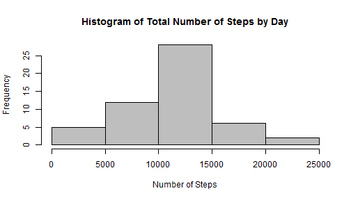
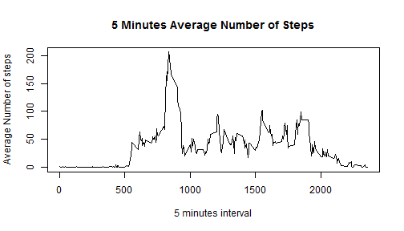
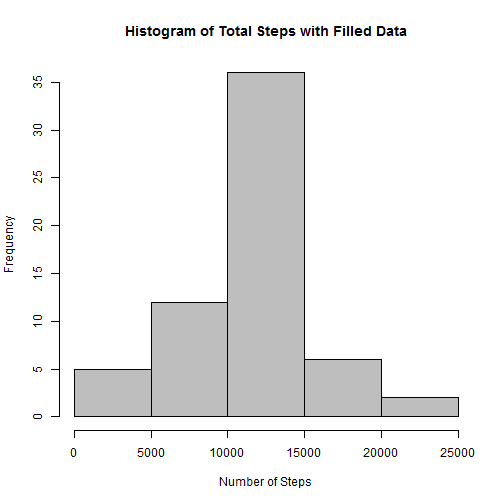
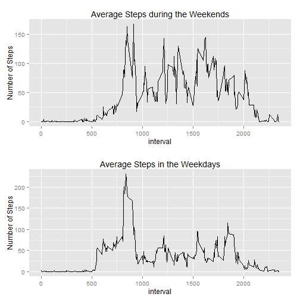

First Assignment for the Coursera Reproducible Research Course  
==============================================================

At the very beginning, I will load the libraries I will need.

```r
library(dplyr)
library(ggplot2)
library(gridExtra)
library(lubridate)
```

1.  Reading the data with **read.csv** and storaging the raw data under a **dplyr** data frame 

```r
rawd <- read.csv(file = "Data/activity.csv",na.strings = "NA",colClasses = c("numeric","Date","numeric"))
rawd <- tbl_df(rawd)
summary(rawd)
```

```
##      steps           date               interval   
##  Min.   :  0    Min.   :2012-10-01   Min.   :   0  
##  1st Qu.:  0    1st Qu.:2012-10-16   1st Qu.: 589  
##  Median :  0    Median :2012-10-31   Median :1178  
##  Mean   : 37    Mean   :2012-10-31   Mean   :1178  
##  3rd Qu.: 12    3rd Qu.:2012-11-15   3rd Qu.:1766  
##  Max.   :806    Max.   :2012-11-30   Max.   :2355  
##  NA's   :2304
```

2.  Transformation of the date variable into a factor and group each other variable by the date.

```r
gdata <- mutate(rawd, date = as.factor(date))
gdata <- group_by(gdata, date)
```

3.  Create a new date frame with three new varibles: **totalsteps**, **mean** and **median**  
3.1.  The new variables **mean and median** represent the mean and median total steps for **each day**.  
3.2.  Remove days were no steps were taken.

```r
sdata <- summarize(gdata, 
                   totalsteps = sum(steps, na.rm = TRUE),
                   mean = mean(steps,na.rm = TRUE), 
                   median = median(steps, na.rm = TRUE))
sdata <- filter(sdata, totalsteps > 0)
head(sdata,n = 5)
```

```
## Source: local data frame [5 x 4]
## 
##         date totalsteps  mean median
##       (fctr)      (dbl) (dbl)  (dbl)
## 1 2012-10-02        126  0.44      0
## 2 2012-10-03      11352 39.42      0
## 3 2012-10-04      12116 42.07      0
## 4 2012-10-05      13294 46.16      0
## 5 2012-10-06      15420 53.54      0
```

4.  Plot an histogram for the *total number of steps taken* **each day**. The plot will be made based on the summarized data frame **sdata**.


```r
with(sdata, hist(totalsteps, 
                 main = "Histogram of Total Number of Steps by Day",
                 xlab = "Number of Steps",
                 ylab = "Frequency",
                 col = "grey"))
```

 

5.  This step calculate the **mean and median** of the total number of steps during the period

```r
totalmean <- mean(sdata$totalsteps,na.rm = TRUE)
totalmedian <- median(sdata$totalsteps, na.rm = TRUE)
```

The results are:  
Mean: $10766$  
Median: $10765$  
      
6.    Now its time to create a time series for the average number of steps in each interval during the day.  
6.1.  First the data frame **gdata** variable interval is tranformed into a factor.  
6.2.  Then it is **gdata** is grouped by the variable **interval** instead of the previous one.  
6.3.   **gdata** is summarize by the new grouping condition and **interval** is trasformed back into a         numeric variable, it important to transform first into character so the value would not be lost.       All those steps are performed into a new data frame **idata**  
6.4.   With **idata** the plot is performed.

```r
      gdata <- mutate(gdata, interval = as.factor(interval))
      gdata <- group_by(gdata, interval)
      idata <- summarize(gdata, intervalmean = mean(steps, na.rm=TRUE))
      idata <- mutate(idata, interval = as.numeric(as.character(interval)))
      with(idata, plot(interval, intervalmean,
                       type = "l",
                       main = "5 Minutes Average Number of Steps",
                       xlab = "5 minutes interval",
                       ylab = "Average Number of steps"))
```

 

7.    Now its time to show the interval that contains the maximum number of steps during the day

```r
      maxim <- idata[which.max(idata$intervalmean),1]
```
The maximum interval is: $835$  
  
8.    To calculate the number of missing values "**NA**", the sum of the function *is.na* is going to be taken.

```r
      sna <- sum(is.na(rawd[,1]))   
```
There are $2304$ missing values in the raw data.  

9.    The strategy used to fill the missing values is based on the mean value for the missing value time period. This means that if a missing value is in the time period **5**, the code will alocate the mean value for that period on its place. A new data frame **fild** is then created.  
9.1   The Histogram is created in the same way it was made in prior steps.  
9.2   The **mean** and **median** are also calculated in the same way.  

```r
      fild <- rawd
      for(i in 1:nrow(fild)){
                if(is.na(fild[i,1])==TRUE){
                        it <- fild[i,3]
                        fild[i,1] <- idata[which(idata[,1]==as.integer(fild[i,3])),2]
                }
      }
      gdata <- mutate(fild, date = as.factor(date))
      gdata <- group_by(gdata, date)
      fdata <- summarize(gdata, totalsteps=sum(steps))
      ftotalmean <- mean(fdata$totalsteps)
      ftotalmedian <- median(fdata$totalsteps)
      with(fdata, hist(totalsteps,
                       main = "Histogram of Total Steps with Filled Data",
                       xlab = "Number of Steps",
                       ylab = "Frequency",
                       col = "grey"))
```

 

The new mean and median are as follow:  
- Mean: $10766$  
- Median: $10766$  

The difference between the new value and the old one, for each value is:  
- Mean: $0$  
- Median: $1.19$  

10. Now it is time to separate weekdays and weekends. Using the **dplyr** mutate, group_by and summarize functions to create two new variables is the method chosen. Those variable are going to be ploted with ggplot2, using the extraGrid library to arrange them into a panel layout.

```r
fild <- mutate(fild, day = factor(1*(wday(ymd(date))>=2 & wday(ymd(date)) <= 6),labels = c("weekend","weekday")))
weekend <- filter(fild, day == "weekend")
weekend <- weekend %>% group_by(interval) %>% summarize(weekendmean = mean(steps))
chartwend <- ggplot(data = weekend, aes(x = interval, y = weekendmean)) + 
                    geom_line() + ggtitle("Average Steps during the Weekends") +
                    ylab("Number of Steps")
weekday <- filter(fild, day == "weekday")
weekday <- weekday %>% group_by(interval) %>% summarize(weekdaymean = mean(steps))
chartwday <- ggplot(data = weekday, aes(x = interval, y = weekdaymean)) + 
                    geom_line() + ggtitle("Average Steps in the Weekdays") +
                    ylab("Number of Steps")
grid.arrange(chartwend, chartwday)   
```

 
